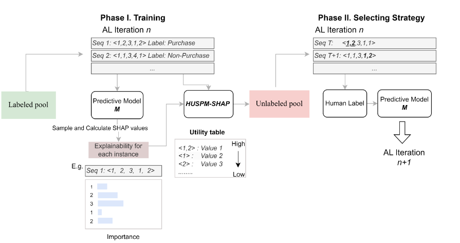

## Abstract

In rapidly evolving e-commerce industry, the capability of selecting high-quality data for model training is essential. This study introduces the High-Utility Sequential Pattern Mining using SHAP values (HUSPM-SHAP) model, a utility mining-based active learning strategy to tackle this challenge. We found that the parameter settings for positive and negative SHAP values impact the model's mining outcomes, introducing a key consideration into the active learning framework. Through extensive experiments aimed at predicting behaviors that do lead to purchases or not, the designed HUSPM-SHAP model demonstrates its superiority across diverse scenarios. The model's ability to mitigate labeling needs while maintaining high predictive performance is highlighted. Our findings demonstrate the model's capability to refine e-commerce data processing, steering towards more streamlined, cost-effective prediction modeling. 



This algorithm is detailed in the following paper. Link: https://arxiv.org/abs/2410.07282


# Active Learning with SHAP Utility Sequence Mining

This repository provides a modular framework for **active learning on sequential data** with integrated **SHAP explainability** and **utility-based sequence mining**.  
It is designed for machine learning workflows that require:
- Flexible sample selection using elements or ordered subsequences (with priority)
- Iterative deep learning (LSTM) model training
- SHAP-based feature attribution and interpretability
- Discovery of top-k utility subsequences for explainable AI

---

## Features
```python
- **Custom Pool-based Active Learning**: Selects training samples based on prioritized rules (element or sequence-based)
- **Automated LSTM Model Training**: Sequential retraining in each active learning iteration
- **Integrated SHAP Analysis**: Explains model predictions at the feature/sequence position level
- **Top-K Utility Sequence Mining**: Finds and ranks subsequences by their total SHAP contribution
- **Data Export**: Combined feature and SHAP tables are exported for further analysis

---

## Installation
pip install -r requirements.txt


## File structure
```python
├── main.py                # Main workflow entry point
├── data_utils.py          # Data loading & preprocessing
├── model_utils.py         # Model definition & training
├── active_learning.py     # Active learning logic
├── shap_utility.py        # SHAP calculation & utility sequence mining
├── requirements.txt
├── sampled_dataset.csv    # Example: initial training set
├── remaining_dataset.csv  # Example: data pool for active learning
└── README.md

## Custom Sample Selection
You can flexibly combine element and sequence-based rules in any order of priority:
```python
criteria_list = [
    {"type": "element", "value": 2},         # First: contains element 2
    {"type": "sequence", "value": [1, 2]},   # Next: contains sequence [1,2]
    {"type": "element", "value": 5},         # Then: contains element 5
]


